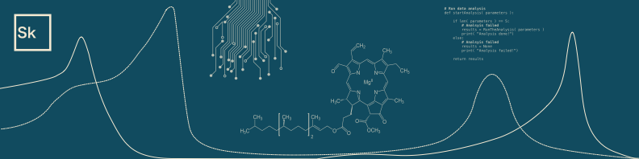

### Hi, I'm Sebastian 👋

I’m working at Michigan State University on a project to better understand the regulation of photosynthesis in highly dynamic environments by developing tools to access photosynthetic phenotypes outside the lab.

Tinkering around with electronics and software, I like to work and build projects, that are not just hacks, but actually integrate in my everyday life.

#### Languages and Tools

#### Find me here

 

